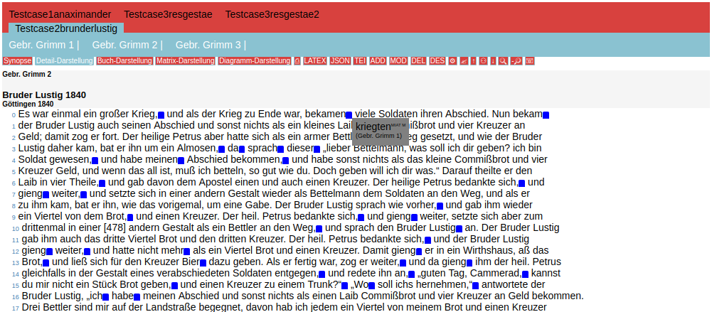
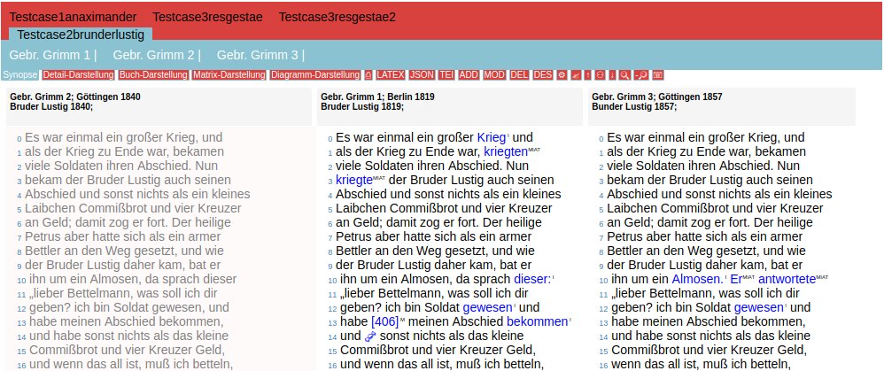
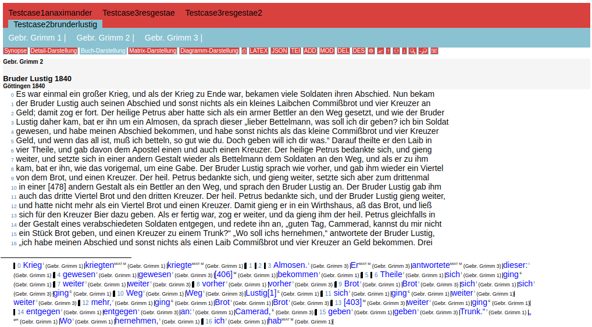

# eComparatio
The main objective of the eComparatio project was to develop a software that is able to achieve an extremely accurate alignment of a text-diff-analysis in a synoptic representation. It turned out that most text diff algorithms are not capable of putting out results of the strength that would be needed to be used as a starting point for a digital edition. We wanted to implement a software that allows the user to focus on the text and to be aware of differences and their clustering in comparison to the base text, as well as a traditional representation similar to the one that can be found in scientific editions, i.e. an apparatus of variants (but with the space and interactive benefits of the screen live), and a synoptic representation of a straight juxtaposition of the lines compared. After we were able to build a comparison program (text diff, differential text analysis etc. etc.) able to supply the needed results, it showed that comparing is much harder a task than one would expect. We started adding classes of differences the program indicates. These classes are: “ganzer Unterschied” ( i.e. total difference), “Unterschied d. Gr.- und Kleinschreibung” (capitalization); “Unterschied d. diakritischen Zeichen”, (diacritics), “Ligatur-Unterschied”, (ligatures), “Umbruch-Unterschied” (line break), “Unterschied d. Interpunktion” (punctuation), “Mehr als im anderen Text” (more than in the text compared), “Weniger als im anderen Text” (less than in the text compared), “Klammerung unterschiedlich” (brackets), “lateinisches U und V” (Latin letters u and v), “Vertauschung” (permutation), “Verdrehung von Passagen” (contortion of words in a given passage), “Mehr im Referenztext” (more words in the text compared), “einzelner Buchstabe” (single letter), “wenige Buchstaben” (a few letters), “Trennung” (word wrap). To evaluate all this classes, and to generate all needed results, we were forced to give up most of the speed coming out of the efficient algorithms, moreover we were forced to evaluate possible errors, to align the most probable text positions, that means we added a optimization like part to the software. To integrate well with other projects, we decided to deliver a primary URN output, to get references to eComparatio, and a CTS URN Input mechanism, to get text from CTS resources (and to reference them).

# How to
Please consult the handbook (currently just in German language), technical specification, use cases, example installation, installation instruction and video tutorials on the documenting page:

http://85.214.109.153/~ecomparatio/

# Change Log / Software Version
Consult the change log for the pre-GitHub Development. This Github Repository starts with the version 1.0.

# Try not you can only loose
Try the open example installation (quick test cases included):

http://85.214.109.153/~ecomparatio/a/

# Stable on 

###### Firefox 

Firefox Quantum 57.0 Linux 64-Bit, Win 10 64-Bit (24.11.2017)

###### Opera

Opera 46.0 Linux 64-Bit, Win 10 64-Bit (24.11.2017)

Opera 49 Win 10 64 Bit (28.11.2017)

###### Chrome / Chromium

Chrome / Chromium 61.0 Linux 64-Bit, Win 10 64-Bit, Mac OS Lion (24.11.2017)

Chrome 62 Win 10 (27.11.2017)

###### Edge / IE

Microsoft Edge 40 Win 10 64 Bit (28.11.2017)

###### Safari

Safari 10.2 (29.11.2017)

# Screenshots

