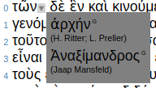

# Manual Inhalt
1. [eComparatio Darstellungen](https://github.com/ecomp-shONgit/ecomparatio/blob/master/manual/README.md#ecomparatio-darstellungen) 
2. [eComparatio Eingabe](https://github.com/ecomp-shONgit/ecomparatio/blob/master/manual/README.md#ecomparatio-eingabe) 
3. [eComparatio Ausgabe](https://github.com/ecomp-shONgit/ecomparatio/blob/master/manual/README.md#ecomparatio-ausgabe) 
4. [eComparatio Customizing](https://github.com/ecomp-shONgit/ecomparatio/blob/master/manual/README.md#ecomparatio-customizing) 
5. [Navigation](https://github.com/ecomp-shONgit/ecomparatio/blob/master/manual/README.md#browser-bedienen) 
6. [Unterschiede / Anderes](https://github.com/ecomp-shONgit/ecomparatio/blob/master/manual/README.md#browser-bedienen) 
7. [Browser bedienen](https://github.com/ecomp-shONgit/ecomparatio/blob/master/manual/README.md#browser-bedienen) 
8. [About Help](https://github.com/ecomp-shONgit/ecomparatio/blob/master/manual/README.md#about-help)
\
\
\
\
\
 
# eComparatio Darstellungen

## Synopse ()
Eine spaltenweise Darstellung der Vergleiche.

### Interaktionen
Die Synopse bietet keine versteckten Funktionen, darum soll an dieser Stelle auf die immer möglichen Interaktionen hingewiesen werden. Der Basistext zu dem die Vergleich angezeigt werden sollen kann in der dritten Menüebene stets gewechselt werden. Der Baistext wird im Menü durch den Editor repräsentiert. Was die Textinteraktion angeht:
Man kann den Text scrollen, entweder mit den Peilen im Menü (), oder mit der Tastenkombination SHIFT+ALT+Scroll(rad,pad). Gescrollt wird um die Einheit und ihre Anzahl, die zur Zeit im Menü festgelegt ist. Um dies zu ändern klicken Sie auf die "Steckdose" zwischen den Peilen. Mit der Angabe der Anzahl von Zeilen die dargestellt werden können Sie ebenfalls die Menge an dargestelltem text variieren. Auch überall zur Verfügung steht das einfärben / auswählen von Unterschiedsarten. Das geschieht über den Menüpunkt (). Dabei verhällt sich die Synopse so, dass die ausgeählten Unterschiede eingefärbt oder entfärbt werden.

## Detail-Darstellung ()
Die Idee zu dieser Darstellung bestand darin, die Unterschiede zu den anderen Texten direkt in den
Referenztext einzutragen.

### Interaktion
Es besteht die Möglichkeit die Unterschiede sich einfärben zu lassen. Die Unterschiede verbergen sich hinter in den Basistext gesetzte Kästchen. Verbirgt das Kätchen unter anderem einen Unterschied, der ausgewählten Unterschiedart, dann wird auf dem Kästchen ein kleines Dreieck angezeigt. Beim Klicken auf das Kästchen () werden die Wörter angezeigt die in den jeweiligen Vergleichstexten zum Unterschied geführt haben. Ein erneuerter Klick verbirgt die Anzeige wieder. Das Kästen, da schon angesehen wird ab nun grau dargestellt. 

## Buch-Darstellung ()
Die Buchdarstellung übernimmt die Ordnung des Variantenapparats.

### Interaktion
Die Darstellung bietet einen ihr wesentliche Funktion. Klickt man entweder auf die Zeilennummer des Basistextes, oder auf die Zeilennummer im Variantenapparat, dann werden die korrespondierenden Zeilen markiert. Nutzt man die Funktion die Unterschiede einzufärben, dann äußert sich diese Funktion nicht farblich, wie in den übrigen Darstellungen, sondern streicht oder nimmt hinzu die Unterschiede der gewählten Art zum Apparat.

## Matrix-Darstellung ()
Die Matrixdarstellung ist eine Erweiterung der Synopse bei der alle Texte in einer Matrix
gegenübergestellt werden.

### Interaktion
Die Matrix-Darstellung bietet, wie die horizontale Juxtaposition, die Möglichkeit die Unterschiede farblich zu markieren. Darüber hinaus, ist es natürlich in dieser vollständigen Darstellung aller Vergleichsreihen das Auftauchen von Wörtern mit den Funktionen des Browser darzustellen.

## Diagramm-Darstellung ()
Diese Darstellung gibt den Vergleich in Diagrammen wieder.

### Interaktion
Zwei Diagramme und einen Tabelle werden für einen Teilvergleich angegeben. Dabei stellt die Tabelle die Auszählung der Unterscheidsklassen nach ihrer Häufigkeit dar. Absolute Häufigkeit und reltive Häufigkeit bezogen auf die Länge des Vergleichstextes können abgelesen werden.

Das erste Diagramm ist ein Balkendiagramm der relativen Häufigkeit nacj Unterschiedsklassen sortiert. Hält man den Maus-Zeiger auf einen Balken bekommt man den Editor des Textes angezeigt, wie auch im eComparatio Menü verwendet.

Das zweite Diagramm ist eine Visualisierung des Vergleichs. Dabei stellt jedes Kästchen ein Wort dar. Die Farben und Striche stellen die Bewertung auf ungleich und gleich dar. Das Halten des Maus-Zeigers über ein Kästchen zeigt das Wort, welches "dahinter steht". Die Darstellung kann als SVG exportiert werden, ein Button findet sich am unteren Rand der Darstellung.

## Interlinear-Darstellung ()
Die Darstellung ist der Synopse natürlich ähnlich, nur werden die vergleichenen Texte interlinear angeordnet.

### Interaktion
Eine synoptische Darstellung muß natürlich nicht die horizontale gegenüberstellung anbieten, sondern kann die Wörter auch vertikal gegenüberstellen. Der Vorteil einer Übersichtlichkeit bleibt der Gleiche. Der unterschied der beiden Darstellungen besteht drin, dass die eine mehr Text des Basistextes, mehr Text aber weniger Vergleichstexten gegenüber stellt (natürlich in Abhängigkeit von der Bildschrimgröße und Text anzahl überhaupt). Die vertikale Gegenüberstellung oder interlineare Organisation zeigt weniger Text jedoch noch genauer gegenübergestellt. Hier ist es wichtig Lücken und das entsprechende Mehr im anderen text visuell praktikabel aufzubereiten. Die Interaktion mit der Darstellung beschränkt sich wiederum auf die farbliche Markierung der Unterschiede.

# eComparatio Eingabe
## Hinzufügen ()
Die neuerliche Eingabe von Textreihen umfasst eine Autosave Funktion. Sie werden beim Aufruf der *ADD* Funktion gefragt, ob sie die gespeicherten Daten benutzen wollen. Falls sie das tun wollen wird aus dem Speicher geholt, was dort zu letzt gelandet ist. Landen kann etwas im Speicher im Sinne eines Abbildes ihrer vormaligen Eingabe. Zu jeder eingabe wird zu jeden vergangen 10 Sekunden ein solches Abbild erstellt und ersetz das vorhandene Abbild. Auf diese Weise sind ihre Arbeitsschritte bei Problemen nicht verloren. Benötigen Sie die Autosave Daten nicht mehr, dann entscheiden sie sich gegen eine Nutzung, wenn das Programm nachfragt. Implizit werden so die Daten wieder auf einen leeren Ausgngspunkt zurück geführt.

Die mit Stern gekenzeichneten Felder müssen eingegeben werden. Wichtig ist die Bennung der Textreihe, diese Benennung wird dann auch im Menü von eComparatio angezeigt. Zwei Werte verdienen zudem Erkläreung: Der Synchronisierungsabstand muss der größte ihnen bekannten Textlück entsprechen. Sind diese nicht bekannt, dann lassen sie den Wert niedrig. Zeigt das Vergleichsergebnis, das sich der Vergleich "verirrt hat", werden also deutlich gleiche Textstellen nicht richtig gegenübergestellt und dies auf ausgedehnteren Abschnitten des Textes, dann erhöhen sie diesen Wert. Das Programm wird dann die richtigen Ergebnisse liefern. Dieser Wert ist für die Performance der Sofwtare kritisch, es ist nicht unbedingt ratsam diesen massiv zu eröhen, wenn nicht Texteinschübe großen Umfangs zwischen den Vergleichstexten u erwarten sind.
Der nächste zu erklärende Wert ist jener der "Alternativen Sortierung". Wenn bei einem vergleich nur festgestellt werden kann, dass die texte ungleich sind, dann ist dies als sehr informationsarmer Zustand anzusehen. Dieser Zustand kennt bezogen auf genau diese Vergleichstselle nicht wie sich der Anschluß an gleiche Textstellen gestalten wird. Das Programm hat zwei Möglichkeiten, entweder einem sehr künstlichen kriterium zu folgen und auf diese Weise die Texte zu vergleichen, oder einfach mit den nächsten beiden Wörtern weiter zu machen. Entsprechend ergeben sich andere Sortierungen der verglichenen Wörter im Bereich von Ungleichheit. 

Die Reichenfolge der Texte, wie sie im menü erscheinen und wie sie in Bezug auf den Basistext dargestellt werden legen sie durch die Eingabereihenfoleg fest. Dies ermöglich chronologische und andere Orndungsprinzipien, welche Prinzipien sie je verfolgen.

## Ändern ()
Für das Editieren können sie ebenfalls die Autosave Funktion nutzen. Dazu wälen sie nachdem sie die Textreihe zur Modifikatio ausgewählt haben *Ok* aus. Anschließend können sie die Modifikation vornehmen. Die Autosave Daten entsprechen ihren Änderungen. Sollte ein Problem auftauchen und wollen sie den Zustand der Texte fortsetzen, dann wählen sie nicht erneut die Modifikation und die Textreiohe, sondern *ADD* und lassen sich die Autosave Daten in ihr Formaular übernehmen, wenn sie gefragt werden. Für die Änderung gilt, was sonst auch für die neue Eingabe gilt. Wollen sie Textreihen kopieren, dann können sie das ebenfalls über die Modifizieren Funktion bewerkstelligen, indem sie einfach einen anderen Namen für die Textreihe vergeben. Sie können nun die beiden Textreihen getrennt voneinander bearbeiten.

## Löschen ()
Das Löschen lässt die Datenreihe aus dem eComparatio Menü verschwinden und macht die Speicherung wieder überschreibbar. Falls ihnen einfallen sollte, dass sie die Daten noch einmal benötigen, dann können diese wieder hergestellt werden solange sie den Cache des Browsers nicht löschen. Wie dies zu bewerkstelligen sei entnehmen sie bitte dem Abschnitt über den Browser

## IN ()
Im Abschnitt *JSON / Dump* wird erklärt, wie man einen Dump im JSON Format exportieren kann. Dies stellt gleichzeitig die Möglichkeit zum Austausch von Daten bei der Testversion dar, bzw. eine Möglichkeit zur Datensicherung. Wählt man nach der Betätigung des Buttons eine entsprechende *.json* eComparatio Datei aus, dann erhält man einen eintrag im eComparatio Menü und die texte und Vergleichsergebnisse werden in eComparatio angezeigt, wenn man diesen Menüeintarg auswählt. Die so importierte Textreihe kann anschließen erweitert und bearbeitet werden.

# eComparatio Ausgabe
Die Ausgaben stellen entweder Grundgerüste dar (XML HTML), dienen der Weiterverarbeitung und dem Austausch (LATEX, CSV, JSON) oder dienen der schnellen Ausgabe (PDF Drucken)

## LATEX ()
Die Ausgabe stellt ein komplettes LaTeX Dokument zur Verfügung, was in Abhängigkeit zur eigenen LaTeX Umgebung direkt oder nach Eingriffen kompiliert. Man kann aber lediglich die Tabellendarstellung der Synopse in eigene Dokunete übernehmen. Die mühevolle Herstellung solcher Tabellen soll ersprat sein.

## JSON / Dump ()
Diese Funktion läßt einen persistentes Abbild der Textreihe erhalten. Man kann diese dann mit anderen Programmen weiter verarbeiten, zum Beispiel eigene graphsiche Ausgaben programmieren oder kann dies Daten wieder eComparatio eingeben.

## TEI ()
Das ausgebbare TEI XML validert, und stellt ein Grundgerüst zur Annonation von Textzeugen und deren Reihendarstellung bereit. Die XML Datein können als Ergebnis, oder als Ausgangspunkt betrachtet werden.

## Drucken ()
Es gibt zwei Varianten des Druckens, einmal mittles eComparatios Menü, was einen Druck mit reduzierten Farben erlaubt und ein Drucken mittels der Browser Funkton Drucken. Die Einrichtung des drucks geschieht wie allgemein bekannt.

## CSV ()
Der Export von CSV Dateien, also Trenner separierten Dateien (Trenner können selbst eingestellt werden, siehe Abschnitt *eComparatio Customizing*) der Synopse, richtet sich an jene, die Ergebnisse gern in ihrer Textverarbeitung weiter verwenden wollen. 

## digitale Edition ()
Die neuerdings dazugekommenen Funktion, hier mit dem richtigen Index *digitale Edition* versehen, um die entsprechenden Zielsetzungen zu adressieren, erlaubt es, funktionsfähige *digitale Editionen* auszugeben. Dabei handelt es sich um HTML Ausgaben der Darstellungen von eComparatio, die jeweis ausgewählt wurde (außer der Diagrammdarstellung). Dabei ist das HTML rudimentär mit CSS Styling versehen und die wenigste mögliche JS Interaction ist beigefügt. Damit lassen sich die Ausgaben in andere Projekte der digitalen Edition integrieren oder eigenständig zu einer dieser Fortführen. Man kann auf die Erfahrung eines Informatikers im Folgenden der Arbeit verzichten, und sich auf die Gestaltung, das Angebot und die Intagration kümmern. Die Ausgabe ist ein Ausgangspunkt, wenn auch ein ausreichend vollständiger. 

# eComparatio Customizing ()
Bedient man das entsprechende Menü, dann bekommt man eine Eingabemaske, die die Legende der Unterscheidesklassen editierbar macht, es ermöglicht die Hervorhebung der Unterschiede anders farblich zu gestalten. Zudem kann das Trenner Zeichen für den CSV Datei Export festgelegt werden. Berücksichtigen sie, dass die Kurzformen der Unterschiedsklassen im Text als Siglen auftauen wird. Berücksichtigen sie auch, das ein Cache Rest des Bwosers ihre Einstellungen vertreiben wird.

# Navigation ()
Die Navigation längerer Texte gelingt durch die Pfeiltasten im Menü. Ein Klick auf einen Pfeil setzt den Text um die angebene Zeilenzahl weiter (Screenzeilen sind nicht die Zeilen ihrer Ausgangsdokumente). Sehr hilfreich ist es, dass auch mit der Tastenkombination Shift + Alt + Scroll(rad) der Text navigiert werden kann. 

# Unterschiede / Anderes 
Die Darstellung der Unterschiedsklassen im Text kann "An" und "Aus" geschaltet werden. Dazu rufen sie die Legende auf (), wählen aus und verbergen diese wieder.
Das Menü kann gezoomt werden, dazu verwenden sie die Lupen ().
Wenn es Probleme gibt, die sie auch in älteren [Handbüchern](http://139.18.121.15/ecomparatio/) oder in den [Videotutorials](http://139.18.121.15/ecomparatio/) nicht klären können, dann benutzen sie die Rückmeldefunktion () (sie können zwischen github und email als Rückmeldung wählen)

# Browser bedienen
## Console
eComparatio in der hier angebotenen Version, bzw. der Online Testversion ist eine JavaScript (JS) Anwendung. JavaScript ist eine Programmiersprache, die im Browser ausgeführt wird, also dem Progarmm mit dem man dem WWW Teils des Internets ansictig werden kann. Der Browser bietet die Möglichkeit die Ausgaben von JS Programmen auf einer Console anzuseigen. eConmparatio nutzt die Console. Die sinnvollen oder nützlichen Hinwiese, oder einfache Rückmeldung können dort abgelsen werden. Lassen sie sich die Console anzeigen diese [Beschreibung](https://webmasters.stackexchange.com/questions/8525/how-do-i-open-the-javascript-console-in-different-browsers) können sie dabei folgen.

## Vergleiche beobachten
Die Vergleiche lassen sie wissen, ob noch einer arbeitet oder ob es einen Fehler gegeben hat. Beobachten sie die Console. rufen sie diese schon nach ihrer Eingabe auf.

## Caches (Datenbanken)
Wollen sie sich die Datenbaken von eComparatio ansehen, dann öffenen sie sich die localStorage Ansicht, wie zum Beispiel in dieser [Beschreibung](https://stackoverflow.com/questions/9404813/how-to-view-or-edit-localstorage). Sie können hier Daten retten. 

# About Help
Die *Help* Funktion, die darin besteht mit dem Handbuch direkt verlinkt zu sein, kann durch Doppelklick auf die Menüpunkte angesprochen werden.
